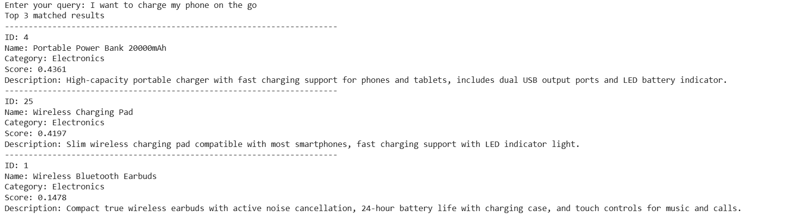

# Semantic Product Search Engine

A small semantic search engine built on a sample product catalog, using Sentence Transformers to match user queries to products based on **meaning**, not just exact keywords.

## What this does

Traditional keyword search only matches exact words. If you search "something to help me sleep" and a product description doesn't literally contain the word "sleep," it won't show up — even if it's a memory foam pillow.

Semantic search solves this by converting text into **embeddings** (numerical vectors that capture meaning), then comparing how close a query is to each product using **cosine similarity**. This means a search like *"gear for a home workout"* can correctly surface a dumbbell set, even without any exact keyword overlap.

## How it works

1. Each product's description is converted into an embedding using a pre-trained transformer model (`all-MiniLM-L6-v2`)
2. The user's search query is converted into an embedding the same way
3. Cosine similarity is calculated between the query embedding and every product embedding
4. Results are ranked by similarity score, and the top-k closest matches are returned

## Project structure

```
├── search.py          # Core logic: catalog, embeddings, similarity, search function
└── README.md
```

## Sample catalog

A small hand-made catalog of 25 products across 5 categories (Electronics, Home & Kitchen, Sports & Outdoors, Clothing, Toys & Games) — used to test whether semantically related queries surface relevant products, even without keyword overlap.

## Tech stack

- **Python**
- **Sentence Transformers** (`all-MiniLM-L6-v2`) — for generating embeddings
- **NumPy** — for cosine similarity calculations

## Example

**Query:** `"I want to charge my phone on the go"`

**Top match:** Portable Power Bank 20000mAh (score: 0.4361)
**Second match:** Wireless Charging Pad (score: 0.4197)

Neither product description contains the literal phrase "on the go" — the match is based on semantic meaning, not keyword overlap.

**Output:**



## Running it

```bash
pip install sentence-transformers numpy
python search.py
```

You'll be prompted to enter a query, and the script will print the top 3 matching products with their similarity scores.

## Notes

This is a small, learning-stage project built to understand how semantic search actually works under the hood — not a production-ready search system. Real-world platforms typically use **hybrid search** (combining keyword-based and semantic methods together) for better precision at scale.
